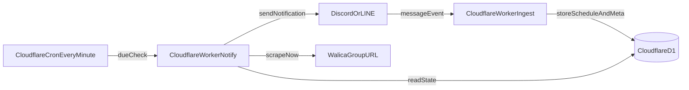

# Walicaトゴシステム 要件仕様書 v0.3

## 1. 背景・目的
- Walica の精算が未完了のまま放置されることを防ぐため、チャット上で自動検知・自動督促を行う bot を提供する。
- Walica URL を投稿した時点で監視を開始し、期限経過に応じた通知と利息反映後の金額を提示する。
- 本仕様は MVP（初期リリース）を対象とし、Discord と LINE の双方を同時対応する。

## 2. 用語定義
- Walica URL: `https://walica.jp/group/<groupId>` 形式の URL。
- 監視対象: Walica URL に紐づく 1 つの割り勘グループ。
- 元本金額: 「清算方法」表で当事者が本来支払うべき金額（利息適用前）。
- 利息: トゴルールとして、10日ごとに元本の 50% を単利で加算する金額。
- 登録メンバー数: Walica 側に登録されているメンバー人数。
- チャット実人数: 通知先チャット内の bot/公式アカウントを除いた人数。
- グループ適用モード: `チャット実人数 <= 登録メンバー数` のときに有効になる継続督促モード。
- 通常モード: `チャット実人数 > 登録メンバー数` のときの非継続督促モード。

## 3. スコープ
### 3.1 MVP スコープ
- Discord 個別チャット/グループでの URL 検知と通知。
- LINE 個別チャット/グループでの URL 検知と通知。
- Walica 公開ページからの「清算方法」表スクレイピング取得（通知生成時の一時利用のみ）。
- 既定通知日の自動通知と、利息計算結果の通知表示。
- 人数比較によるモード分岐（グループ適用モード / 通常モード）。
- 支払い報告コマンド（`払った` / `払ってない`）の受理。

### 3.2 非スコープ（MVP外）
- Walica アカウント連携（OAuth）や公式 API 連携（存在前提なし）。
- 送金決済機能（PayPay/銀行連携等）。
- AI による通知文自動生成（固定テンプレートのみ）。
- Web 管理画面（MVP はチャットコマンドのみ）。

## 4. 想定アーキテクチャ

- Ingest Worker: URL 検知、監視セッション登録、通知イベント作成、Walica 最小メタ情報保存を行う。
- Notify Worker: Cron から起動し、送信期限到来イベントを抽出して通知送信する。
- D1: 監視状態、通知イベント、送信履歴、Walica 最小メタ情報のみを保持する。

## 5. ユースケース
### UC-01 URL 初回投稿
- ユーザーが Discord/LINE の任意チャットに Walica URL を投稿する。
- bot が URL を検知し、監視開始メッセージを返信する。
- Walica URL 投稿時刻と登録メンバー数を D1 に保存する。
- チャット実人数を取得し、適用モードを決定する。

### UC-02 期限到来通知
- Cron が期限到来イベントを検知する。
- Walica ページから「清算方法」表を抽出する（永続保存しない）。
- 元本と利息込み金額を計算し、怖いセンパイ口調で通知送信する。

### UC-03 グループ適用モード通知
- 「あと〇人払ってねえなあ？」系メッセージを追加する。
- 個別メンションは行わず、`@all` による全員通知とする。
- `@all` と支払い報告導線を含め、報告完了まで通知を継続する。

### UC-04 通常モード通知
- Day3, Day5, Day7, Day9, Day10 の通知は実施する。
- Day10 の 10日5割通知を 1 回送信した時点で自動終了する。

## 6. 機能要件
### FR-01 URL 検知・検証
- 対象 URL は `https://walica.jp/group/<groupId>` を許可する。
- クエリや末尾スラッシュ付きは正規化して同一判定する。
- URL 到達不可またはページ取得失敗時は登録失敗として通知する。
- 1 メッセージ内に複数 URL がある場合は全件処理する。

### FR-02 監視登録・状態管理
- 監視登録時に保存する項目:
  - platform（discord/line）
  - conversationId（DM/グループ識別子）
  - postedBy（投稿者識別子）
  - walicaGroupId、walicaUrl
  - walicaPostedAt（URL が貼られた時刻）
  - walicaMemberCount（登録メンバー人数）
  - timezone（初期値: Asia/Tokyo）
- セッション状態: active / paused / closed。
- モード状態: group_mode / normal_mode。

### FR-03 通知スケジューリング
- Day0 を URL 投稿時刻とし、既定通知イベントを作成する。
  - Day3, Day5, Day7, Day9, Day10, Day19, Day20
- 追加ルール:
  - 利息増加日の 1 日前に通知
  - 利息増加日に通知
- グループ適用モードでは Day20 以降も通知イベントを無期限で生成し続ける。
  - 利息イベント系列: Day30, Day40, Day50 ...（前日通知も同様に継続）
- 通常モードでは Day10 通知成功後に残イベントを無効化してセッションを closed にする。
- Cron は毎分実行し、`now >= scheduledAt` の pending イベントを対象に送信する。
- 送信前にイベントロックを取得して重複送信を防止する。

### FR-04 利息計算（10日5割・単利）
- 利息回数 `n = floor(経過日数 / 10)`。
- 利息額 `interest = principal * 0.5 * n`。
- 請求額 `total = principal + interest`。
- 1 円未満は切り上げ（ceil）で統一する。

### FR-05 Walica データ抽出と保存制約
- Walica 公開ページから「清算方法」表を抽出する。
- 抽出値の利用目的は通知本文生成に限定する。
- スクレイピング結果（HTML、抽出JSON、明細テーブル）は DB に保存しない。
- DB に保存する Walica 由来データは以下のみとする。
  - URL 投稿時刻（walicaPostedAt）
  - 登録メンバー人数（walicaMemberCount）
- 取得失敗時は最大 3 回再試行する。

### FR-06 モード分岐・再評価
- 判定条件:
  - `チャット実人数 <= 登録メンバー数`: グループ適用モード
  - `チャット実人数 > 登録メンバー数`: 通常モード
- モード判定は登録時だけでなく、毎通知時に再評価する。
- 再評価でモードが変わった場合は、次の通知から新モードの送信ルールを適用する。
- モード遷移履歴（old_mode, new_mode, judged_at）はログに残す。

### FR-07 グループ適用モード通知仕様
- 通知本文に「あと〇人払ってねえなあ？」相当メッセージを追加する。
- 個別ユーザーへのメンションは行わず、`@all` による全体通知とする。
- 未払い人数は `max(登録メンバー数 - 支払い報告済み人数, 0)` で算出する。
- 未払い人数が 0 になるまで通知を継続する。

### FR-08 支払い報告コマンド
- `@bot 払った` を支払い報告として受理する。
- `@bot 払ってない` を支払い取消として受理する。
- 「払った」同義語を受理する（最低限の初期辞書）。
  - 済み
  - 支払い完了
  - 入金した
  - 振り込んだ
  - 払いました
  - 払っといた
- 誤認識防止のため、肯定/否定キーワードの優先順位を明示して判定する。

### FR-09 通知文面
- 通知は「怖いセンパイ口調」テンプレートを用いる。
- 通知本文に含める項目:
  - 経過日数
  - 通知種別（通常/利息前日/利息発生日）
  - 清算方法（表形式または箇条書き）
  - 元本金額
  - 利息額
  - 利息込み請求額
  - （グループ適用モード時のみ）`@all` と未払い推定人数、報告導線

## 7. データ要件（Cloudflare D1）
### 7.1 テーブル（論理）
- `watch_sessions`
  - id (PK), platform, conversation_id, walica_group_id, walica_url, posted_by, status, mode, timezone, created_at, updated_at
- `walica_meta`
  - session_id (PK/FK), walica_posted_at, walica_member_count
- `payment_reports`
  - id (PK), session_id (FK), reporter_user_id, report_type(paid/unpaid), reported_at
- `notification_rules`
  - id (PK), session_id (FK), day_offset, event_type(normal/pre_interest/interest_up), enabled
- `notification_events`
  - id (PK), session_id (FK), scheduled_at, event_type, locked_at, sent_at, status(pending/locked/sent/failed), retry_count
- `mode_transition_logs`
  - id (PK), session_id (FK), old_mode, new_mode, judged_at, reason
- `delivery_logs`
  - id (PK), event_id (FK), platform, destination_id, provider_message_id, delivered_at, error_code, error_message

### 7.2 保存禁止要件
- Walica ページの生 HTML は保存禁止。
- 「清算方法」表の抽出結果 JSON は保存禁止。
- スクレイピング結果キャッシュは保持禁止。

### 7.3 インデックス
- `notification_events(status, scheduled_at)` 複合インデックス。
- `watch_sessions(platform, conversation_id, walica_group_id)` 一意相当判定用。

## 8. 外部 I/F 要件
### 8.1 Discord
- Message Create Event を受信し URL 検知する。
- 通知は Bot Token でチャネル送信する。
- グループ人数取得 API で bot を除外して実人数を算出する。

### 8.2 LINE
- Messaging API Webhook で受信する。
- 返信/Push メッセージで通知送信する。
- グループ人数取得時は公式アカウントを除外して実人数を算出する。

### 8.3 Walica
- 公開 URL を GET し HTML から「清算方法」を抽出する。
- 抽出内容はメモリ上のみで扱い、DB 永続化しない。

## 9. 非機能要件
### 9.1 性能
- URL 検知応答: 95 パーセンタイル 3 秒以内。
- 通知遅延: 期限時刻から 2 分以内（Cron 毎分 + API 遅延含む）。

### 9.2 可用性・耐障害性
- 送信失敗は最大 3 回再試行する。
- 失敗継続時は failed として記録し、手動再送対象にする。
- 冪等キー（event_id）で重複送信を回避する。

### 9.3 セキュリティ・データ保護
- Discord/LINE トークンは Cloudflare Secrets で管理する。
- 個人情報は最小保持（識別子のみ）とする。
- Walica スクレイピング結果を DB に保存しないポリシーを厳守する。

## 10. 通知仕様詳細
### 10.1 既定通知日
- Day3, Day5, Day7, Day9, Day10, Day19, Day20

### 10.2 利息イベント通知
- 利息増加日: Day10, Day20, Day30, Day40 ...（10日刻み）
- 前日通知: Day9, Day19, Day29, Day39 ...（10日刻み）
- グループ適用モードでは上記系列を無期限で継続する。
- 同日重複時は 1 通に集約する。

### 10.3 文面例
- 通常: 「10日経過。利息が上がった。今の請求額はこれ。」
- グループ適用モード: 「`@all` あと〇人払ってねえなあ？払ったやつは `@bot 払った` って報告しな。」

## 11. 受け入れ基準（Given/When/Then）
### AC-01 名称
- Given 本システムの仕様書を確認する
- When タイトルと本文のシステム名を読む
- Then 「Walicaトゴシステム」で統一されている

### AC-02 Walica保存制約
- Given 通知処理でスクレイピングを行う
- When D1 保存内容を確認する
- Then Walica 由来の保存データは投稿時刻と登録メンバー数のみである

### AC-03 保存禁止
- Given 通知処理が完了する
- When D1 の全テーブルを確認する
- Then スクレイピング結果（HTML/抽出JSON/清算表）が保存されていない

### AC-04 グループ適用モード通知
- Given チャット実人数 4、登録メンバー数 5
- When 判定処理を実行する
- Then `@all` を含む未払い人数メッセージ付き通知が送られる

### AC-05 通常モードの通知継続と自動終了
- Given チャット実人数 6、登録メンバー数 5
- When Day3/5/7/9/10 の通知を処理する
- Then Day10 通知までは送信継続し、Day10 の 10日5割通知送信後に closed になる

### AC-06 無期限通知
- Given グループ適用モードのセッションが active
- When Day20 を過ぎる
- Then Day30 以降の利息通知系列も継続して生成・送信される

### AC-07 支払い報告ループ
- Given グループ適用モードで未払い人数が 2
- When `@bot 払った`（または同義語）報告が 2 件受理される
- Then 未払い人数が 0 になり、継続通知が停止する

### AC-08 毎通知時再評価
- Given 初回判定が group_mode のセッション
- When 次回通知時に `チャット実人数 > 登録メンバー数` へ変化する
- Then 通知直前再評価で normal_mode へ遷移し、以後 normal_mode の終了条件を適用する

## 12. 前提・制約・リスク
- Walica 側 HTML 構造変更時は抽出失敗する可能性がある。
- Discord/LINE の人数取得 API 仕様差分により、実人数算出の補正が必要になる可能性がある。
- 個別未払い者の厳密特定は行わず、MVP は報告ベースで未払い人数を管理する。
- Cron 毎分実行のため、秒単位の厳密配信は保証しない。

## 13. 未確定事項
- 同義語辞書の拡張上限（初期 10 語 / 20 語など）の運用基準。
- `@all` が使えない環境での代替文言（全体通知タグなし文面）運用。

## 14. 参照
- Walica サービスページ: [https://walica.jp/group/01M1P9H89WEFKGG6W5WGRMYHMX](https://walica.jp/group/01M1P9H89WEFKGG6W5WGRMYHMX)
